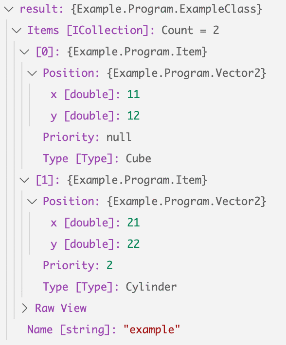

# MiniJsObject

Parser for C# object using Dictionary and List like Javascript object.  
Easy to use for such as Unity because this program is only one file.  

This project inspired by Calvin Rien's [darktable/MiniJSON.cs](https://gist.github.com/darktable/1411710),  
thanks a lot ツ .

## Setup

Copy [MiniJsObject.cs](https://github.com/r01hee/MiniJsObject/blob/master/MiniJsObject.cs) in your project.  

## Usage

To use [darktable/MiniJSON.cs](https://gist.github.com/darktable/1411710) together is good!  

1. Copy [darktable/MiniJSON.cs](https://gist.github.com/darktable/1411710) in your project, too.  

2. Refer to the following code.  

```csharp
using System.Collections.Generic;

namespace Example
{
    class Program
    {
        enum Type
        {
            Cube = 0,
            Sphere = 1,
            Cylinder = 2,
        }

        class Vector2
        {
          // public fields
          public double x;

          public double y;

          // must have a public parameterless constructor
          public Vector2() {}

          public Vector2(int x, int y)
          {
            this.x = x;
            this.y = y;
          }
        }

        class Item
        {
          // nullable
          public int? Priority { get; set; }

          // enum
          public Type Type { get; set; }

          // nested object
          public Vector2 Position { get; set; }
        }

        class ExampleClass
        {
            // public properties
            public string Name { get; set; }

            // collection
            public ICollection<Item> Items { get; set; }
        }

        static void Main(string[] args)
        {
            string json = @"
{
    ""name"": ""example"",
    ""items"": [
        {
            ""type"": ""Cube"",
            ""priority"": null,
            ""position"": {
                ""x"": 11,
                ""y"": 12
            }
        },
        {
            ""type"": 2,
            ""priority"": 2,
            ""position"": {
                ""x"": 21,
                ""y"": 22
            }
        }
    ]
}";
            ExampleClass result = MiniJsObject.JsObject.FromJsObject<ExampleClass>(MiniJSON.Json.Deserialize(json));
        }
    }
}
```

3. `result` is ...  



## Not Implemented 

- ToJsObject() method

## License

[MIT license](LICENSE)